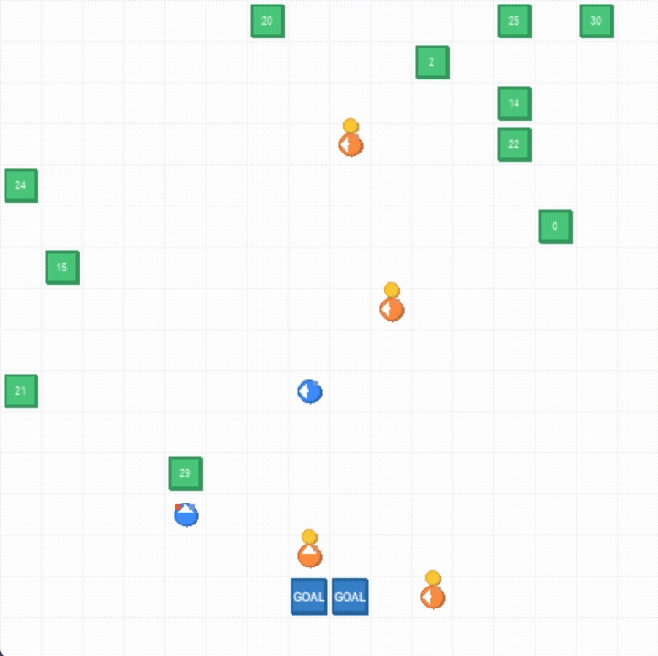

# Warehouse Multi-Agent System (MAS)

[](https://www.python.org/downloads/)
[](LICENSE)

Deterministic multi-agent warehouse coordination with formal safety verification and constraint-guided refinement.

## Overview

This project simulates robots in a grid warehouse where agents pick requested shelves and deliver them to goal cells.  
The system is intentionally non-ML: planning, verification, and refinement are all explicit algorithmic components.

Core properties:

- Deterministic planning policy
- Collision-aware multi-agent coordination
- Symmetry-reduced verification on quotient states
- Counterexample-driven refinement loop
- Real-time visualization with pygame

## Demo



## System Architecture

The runtime loop is:

1. **Plan**: compute one action per agent with a prioritized time-aware planner.
2. **Step**: apply actions in the environment and record conflicts/collisions.
3. **Verify** (optional): run bounded checks over symmetry-reduced state keys.
4. **Refine** (optional): convert counterexamples into hard planner constraints.

Main modules:

- `env.py`: grid environment, rewards, rendering, episode control
- `agent.py`: robot direction/action primitives and pick/drop behavior
- `pathfinding.py`: reservation-based planner and constraints interface
- `symmetry_reduction.py`: role orbit detection and canonicalization
- `verification.py`: bounded quotient safety checks
- `refinement.py`: constraint extraction from conflicts/traces
- `main.py`: CLI entry point and orchestration

## Planning Model

`CooperativePlanner` in `pathfinding.py` uses a prioritized multi-agent strategy:

- Agents are assigned to requested shelves (nearest matching).
- Agents are planned sequentially by ID.
- Each planned trajectory reserves vertices and edges in a time-indexed reservation table.
- A* search runs on `(x, y, dir, t)` and rejects moves violating:
  - grid bounds
  - reservation conflicts
  - refinement constraints
- If a full plan is not found in the expansion/time budget, the planner selects a deterministic immediate safe fallback action.

This keeps planner behavior predictable while still handling congestion and contention.

## Verification and Refinement

Verification (`verify_on_quotient`) performs bounded trials and tracks:

- collisions
- minimum pairwise Manhattan separation
- quotient safety margin (`delta_q`)

If unsafe behavior is found, the returned conflict trace is consumed by refinement (`refine_planner_with_conflicts`), which adds hard constraints (vertex/edge/boundary) back into the planner.  
The verify-refine loop is executed iteratively by `main.py`.

## Installation

```bash
pip install -r requirements.txt
```

## Usage

Interactive simulation (rendered):

```bash
python main.py --mode interactive --render
```

Batch simulation:

```bash
python main.py --mode simulate --episodes 8 --steps-per-episode 200
```

Evaluation mode:

```bash
python main.py --mode eval --eval-episodes 3 --steps-per-episode 150
```

Verification + refinement:

```bash
python main.py --verify-refine --verify-horizon 30 --verify-trials 20
```

Symmetry inspection:

```bash
python main.py --detect-symmetry
```

## Configuration

Runtime configuration is loaded from `config.yaml`.

```yaml
grid:
  width: 16
  height: 16
  cell_size: 30

agents:
  num_agents: 6
  num_shelves: 8
  goals:
    - [7, 14]
    - [8, 14]

planning:
  horizon: 30
  astar_max_nodes: 3500
  idle_limit: 4

render:
  fps: 2

verification:
  min_separation: 1
  horizon: 30
  trials: 20

refinement:
  iterations: 2
  max_constraints: 100
```

Notes:

- `render.fps: 2` gives approximately `0.5s` per rendered step.
- CLI flags override YAML defaults when provided.

## Testing

Run all tests:

```bash
python tests/run_tests.py
```

Run focused suites:

```bash
python tests/test_refinement.py
python tests/test_verification_refinement.py
```

## Documentation

Static documentation site:

- `docs/index.html`

## License

MIT License. See `LICENSE`.
